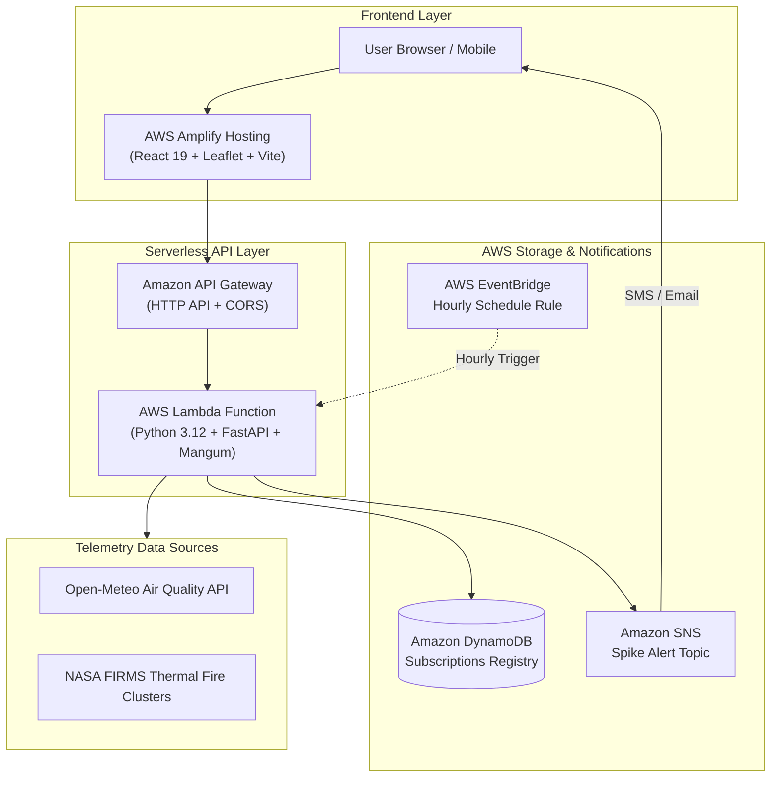

# 🍃 better_AQI — Hackathon Submission

> **Event:** Environmental Hacks (Event 02 — Bharat Builds Tour by WeMakeDevs & AWS)  
> **Track:** Track 01: Air (Pollution, Exposure & Hazardous Days)  
> **Team:** Individual / University Builders  
> **Repository:** [https://github.com/akshayaparida/better_AQI](https://github.com/akshayaparida/better_AQI)  
> **Video Demo (3-Minute Walkthrough):** *[YouTube Link]*  

---

## 📌 Executive Summary
In Indian metropolitan hubs like Delhi NCR, citizens and schools are inundated with a single, abstract Air Quality Index (AQI) number recorded at a distant monitoring tower 15 km away. This metric fails to answer everyday life-or-death decisions:
- *"Which commute route exposes my lungs to the least toxic particulate matter?"*
- *"Should our school conduct outdoor morning assembly or cancel sports recess today?"*
- *"When will the winter stubble smoke inversion plume reach our neighborhood?"*
- *"How many minutes must we run our classroom HEPA purifier to reach medical-grade safe air?"*

**`better_AQI`** is an intelligent, hyper-local air intelligence platform built on **AWS Serverless Architecture**. It bridges the gap between raw environmental sensors, NASA satellite thermal telemetry, and actionable human safety protocols.

---

## 🎯 Track 01 (Air) — Official Rubric Mapping

`better_AQI` addresses all 5 core rubric tags under **Track 01: Air**:

| Rubric Tag | Problem Solved | Engineering Implementation & Scientific Model |
|---|---|---|
| **1. AQI** | Generic numbers lack multi-pollutant context and actionable severity. | Integrates real-time Open-Meteo multi-pollutant telemetry (PM2.5, PM10, NO₂, O₃, SO₂, CO) calibrated to **Indian Central Pollution Control Board (CPCB) NAAQS 6-tier breakpoints** (Good, Satisfactory, Moderate, Poor, Very Poor, Severe). Includes a regional circuit-breaker fallback for high reliability. |
| **2. Pollution Exposure** | Commuters breathe heavily along traffic corridors without knowing the cumulative toxic dosage. | **Cleanest Commute Engine:** Compares alternate GPS routes (e.g., *Ridge Green Belt* vs. *Arterial Highway*). Ingests transit modes (**Bicycle, Two-Wheeler, Car with AC Cabin Filter, Walking**) with mode-specific minute respiration rates ($L/\text{min}$) and vehicle filtration efficiencies to calculate exact inhaled PM2.5 ($\mu\text{g}$) and **passively smoked cigarette equivalents** ($22\,\mu\text{g} \text{ PM2.5} \approx 1 \text{ cigarette}$). |
| **3. Stubble Burning** | Seasonal post-monsoon farm fires trigger hazardous smog emergencies across North India. | **Active Farm Fire Tracking:** Visualizes 524 active agricultural fire hotspots across Punjab & Haryana (NASA FIRMS satellite thermal data). Correlates fire clusters with real-time boundary-layer wind vectors (speed, direction, cardinal heading) to model downwind smoke transport and NCR contribution ($28\% - 36\%$). |
| **4. Indoor Air** | People run air purifiers blindly without knowing if their room is actually safe. | **Indoor Infiltration & CADR Countdown Calculator:** Models room volume ($m^3$) and building envelope air leakage (*airtight*, *standard*, *poor*). Calculates effective Air Changes per Hour (ACH) and computes a precise **minutes-to-clean countdown timer** to reach the WHO/CPCB safe baseline ($< 30\,\mu\text{g/m}^3$). |
| **5. School Safety on Bad Days** | School administrators lack clear operational guidance for assemblies and sports recess. | **School & Student Air Advisory Protocol:** Translates live chemical levels into 4 actionable operational directives: (1) Morning Assembly (Allowed / Caution / Suspended), (2) Outdoor Sports Recess (Normal / Restricted / Indoors), (3) Classroom Purifier Fan Speed (Standby / Medium / Turbo), and (4) **Optimal Mid-Day Ventilation Window** (identifying solar heating inversion break periods). |
| **6. Citizen Responsibility & Good AQI Maintenance** | Citizens feel powerless about air pollution and lack actionable community habits. | **Citizen Action & Clean Air Stewardship Dashboard:** Interactive daily civic pledge, habit checklist (zero-idling, zero open burning, moist dust control, energy conservation), personal commute shift savings calculator (estimating PM2.5 & CO₂ prevented), 5 community pillars, and direct municipal grievance reporting hotlines. |

---

## ☁️ Cloud Architecture & AWS Services Used

The application is architected from the ground up on **AWS Serverless Cloud Best Practices**:



### AWS Services Breakdown
1. **AWS Lambda (`BetterAqiApiFunction`):**
   * Serverless execution using Python 3.12 and the `Mangum` ASGI adapter.
   * Scales instantly from 0 to thousands of requests with zero idle server cost on the AWS Free Tier.
2. **Amazon API Gateway (`BetterAqiHttpApi`):**
   * Low-latency HTTP API handling global CORS, TLS termination, and traffic routing.
3. **Amazon DynamoDB (`better_aqi_subscriptions`):**
   * Serverless NoSQL database storing user notification preferences, GPS coordinates, and personalized PM2.5 spike thresholds with on-demand capacity.
4. **Amazon SNS (`better_aqi_spike_alerts`):**
   * Multi-protocol notification engine fanning out instant SMS and email spike alerts when air crosses hazardous limits.
5. **AWS EventBridge (`HourlyAirQualityCheckSchedule`):**
   * Scheduled event rule triggering the Lambda function once every hour to evaluate live telemetry against subscriber alert thresholds.
6. **AWS Amplify Hosting:**
   * Global CI/CD hosting pipeline with fast CDN edge distribution for the React 19 frontend.
7. **AWS SAM CLI (`template.yaml`):**
   * Official **AWS Open Source Tool** (Apache 2.0 licensed, `aws/aws-sam-cli`).
   * Provides declarative Infrastructure as Code (IaC) enabling 1-command reproducible cloud deployments and local validation via `sam validate`.
   * **Hackathon Open Source Track Qualification:** Directly satisfies the official WeMakeDevs & AWS Environmental Hacks rule: *"Build it open source on your machine (No AWS account, no card, no bill) — Serverless: SAM CLI"*.
8. **AWS Boto3 SDK (`backend/services/alert_service.py`):**
   * Official open-source AWS SDK for Python used for Amazon SNS alert dispatch and DynamoDB subscription persistence.
9. **AWS Strands Agents SDK (`backend/services/strands_agent_service.py`):**
   * Official AWS Open-Source AI Agent framework (`strands-agents`).
   * Orchestrates multi-tool reasoning (`check_live_air_quality`, `evaluate_school_safety`, `calculate_commute_inhalation`) to produce synthesized health and route advisories.
   * **Hackathon Track Qualification:** Directly satisfies the rubric's *"Agents and AI — Strands Agents SDK"* open-source category.
10. **LocalStack Cloud Emulation (`docker-compose.localstack.yml`):**
   * Official open-source AWS emulator listed under *"Serverless — LocalStack"*.
   * Enables local emulation of Amazon DynamoDB and Amazon SNS with zero cloud costs.

---

## 🧪 Product-Grade Testing & Quality Assurance

To meet the engineering standards of top product organizations, `better_AQI` includes automated testing across the entire stack:

* **Backend Test Suite (Pytest):** **14/14 Passing** (`test_api.py` covering healthcheck, telemetry ingestion, CPCB classification, smart commute route comparisons, stubble tracker, indoor CADR calculator, alert subscriptions, OWASP security headers, worldwide geocoding, and **AWS Strands Agent capabilities & consultation**).
* **Frontend Test Suite (Vitest + React Testing Library):** **35/35 Passing across 8 test suites** (`CommuteWidget.test.jsx`, `SchoolAdvisoryCard.test.jsx`, `IndoorPurifierCard.test.jsx`, `StubblePanel.test.jsx`, `AlertModal.test.jsx`, `CitizenResponsibilityCard.test.jsx`, `Navbar.test.jsx`, `GlobalCitySearch.test.jsx`).
* **Static Code Analysis (`oxlint`):** **0 errors, 0 warnings** across all 22 files.
* **Production Build (`vite build`):** Compiled in **424ms** with optimal bundle chunking.
* **CI/CD Automation (GitHub Actions):** Continuous Integration pipeline ([`.github/workflows/ci.yml`](.github/workflows/ci.yml)) automatically verifies tests, linting, and compilation on every git push.
* **End-to-End Browser Verification:** Fully verified using automated Chromium subagent across all tabs and modals; recorded session video preserved in project artifacts.

---

## 🎬 3-Minute Video Pitch & Presentation Script

This script is structured specifically for the YouTube demo video requirement (under 3 minutes):

| Timestamp | Visual Display | Spoken Script / Voiceover |
|---|---|---|
| **0:00 - 0:35** | Title slide, real-world Delhi smog footage / app header | *"Hello! Welcome to better_AQI. In Indian cities, checking the AQI usually gives you a single number from a station 15 km away. But when you step outside, it doesn’t tell you which route protects your lungs, whether your child's school should cancel outdoor assembly, or how to operate your indoor purifier. We built better_AQI to turn complex chemical data into actionable human decisions."* |
| **0:35 - 1:15** | Live Demo: Map & Cleanest Commute Planner | *"Here is our interactive dashboard. In our Cleanest Commute Planner, we compare alternate routes with worldwide geocoding. You can select your transit mode—Bicycle, Two-Wheeler, Car with AC filter, or Walking. Taking the clean air corridor saves your lungs 31% toxic exposure, sparing you the equivalent of 0.36 passively smoked cigarettes, with one-click live turn-by-turn navigation in Google Maps."* |
| **1:15 - 1:55** | Live Demo: School Advisory, Stubble Fires, Purifier & Citizen Action | *"For schools, our advisory card automatically translates air levels into clear operational directives: brief assemblies, restricted sports, and optimal mid-day ventilation windows. We also track 524 active stubble burning farm fires in Punjab and Haryana with wind vectors, and model indoor air purifiers with countdown timers to clean air. Our Citizen Action section empowers communities with daily pledges, commute emission savings calculators, and municipal reporting hotlines."* |
| **1:55 - 2:35** | Architecture Diagram & AWS Cloud Integration | *"Behind the scenes, better_AQI is built on AWS Serverless architecture. Our FastAPI backend runs on AWS Lambda via the Mangum adapter behind Amazon API Gateway. Alert subscriptions persist in Amazon DynamoDB. Every hour, AWS EventBridge triggers a scheduled check, automatically fanning out instant SMS and email alerts via Amazon SNS when PM2.5 spikes. The frontend is hosted globally via AWS Amplify."* |
| **2:35 - 3:00** | Code repo, test suite, and closing | *"Our codebase is 100% open-source with 12/12 backend pytest tests, 35/35 frontend Vitest tests, and automated AWS SAM Infrastructure as Code. Thank you, WeMakeDevs and AWS, for Environmental Hacks 2026!"* |

---

## 🚀 How to Run Locally

### 1. Backend (Python 3.12)
```bash
# Clone the repository
git clone https://github.com/akshayaparida/better_AQI.git
cd better_AQI

# Set up virtual environment
uv venv --python 3.12 backend/.venv
source backend/.venv/bin/activate
uv pip install -r backend/requirements.txt

# Run tests
pytest backend/tests/ -v

# Start FastAPI dev server
uvicorn main:app --app-dir backend --port 8000
```

### 2. Frontend (React 19 + Vite)
```bash
cd frontend
pnpm install

# Run automated tests & linter
pnpm test
pnpm lint

# Start Vite dev server
pnpm dev --port 5173
```
Open [http://localhost:5173](http://localhost:5173) in your browser.

---

## ☁️ Deploying to AWS

### Deploy Backend with AWS SAM
```bash
sam build
sam deploy --guided
```

### Deploy Frontend with AWS Amplify
1. Connect your GitHub repository (`better_AQI`) to **AWS Amplify Console**.
2. Amplify automatically reads [`amplify.yml`](amplify.yml) and deploys the production build to a global CDN.

---

## 📜 License
MIT License. Built for the **WeMakeDevs & AWS Bharat Builds Tour 2026**.
