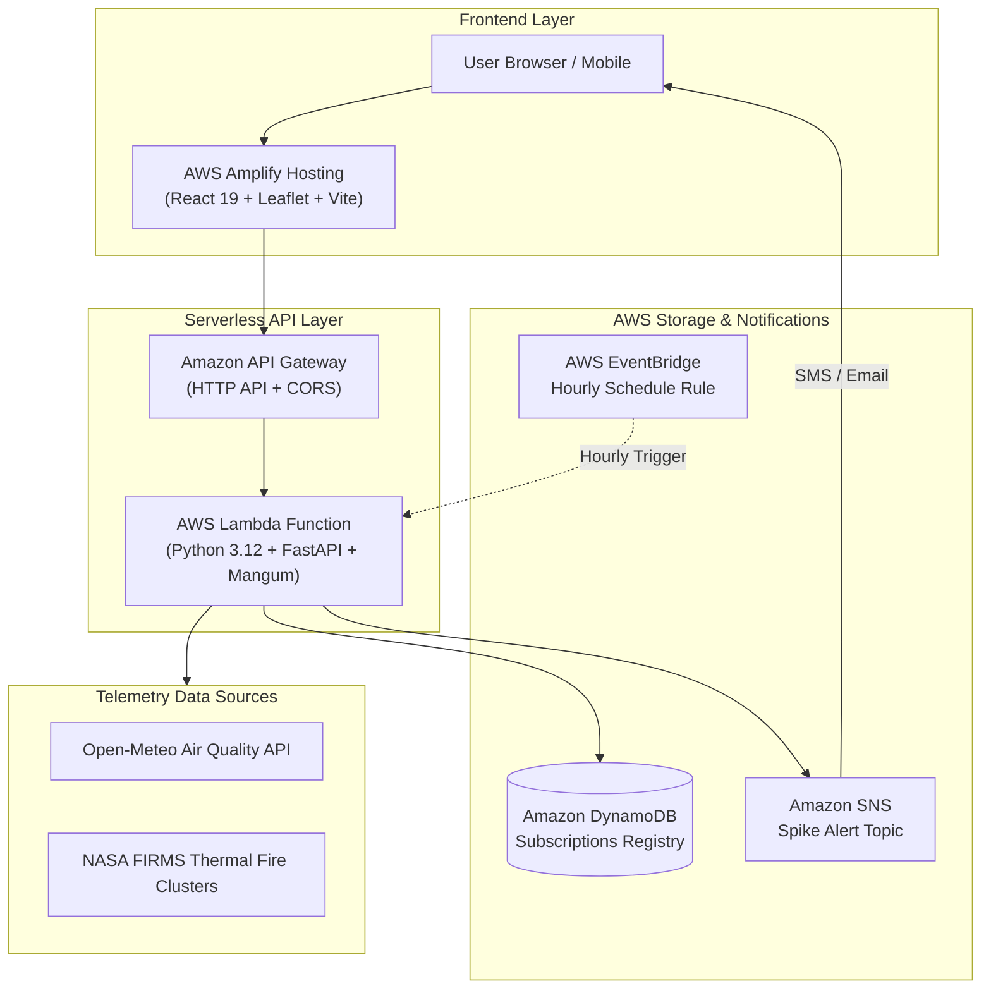

# better_AQI 🍃

> **Hyper-local air quality intelligence, cleanest commute exposure planning, and automated health advisories.**  
> Built for **Environmental Hacks (Bharat Builds Tour 2026 by WeMakeDevs & AWS)** • **Track 01: Air**

[](.github/workflows/ci.yml)
[](backend/tests/)
[](frontend/src/tests/)
[](frontend/)
[](template.yaml)
[](LICENSE)

---

## 📄 Hackathon Submission Document
👉 **Read the full submission write-up & 3-minute video presentation script in [`HACKATHON_SUBMISSION.md`](HACKATHON_SUBMISSION.md).**

---

## 🌍 The Problem
Most air quality apps display a single, generic AQI number from a monitoring station 15 km away. They fail to answer the critical daily questions faced by citizens, commuters, and school administrators:
- *“Which route between Connaught Place and Rohini exposes my lungs to the least toxic PM2.5?”*
- *“How many passively smoked cigarettes does my commute exposure equate to?”*
- *“Is it safe for our school to hold outdoor morning sports or assembly today?”*
- *“How many minutes must we run our classroom HEPA purifier to reach medical-grade safe air?”*

**better_AQI** bridges the gap between raw environmental sensor data, satellite thermal fire detection, and actionable human decisions.

---

## ✨ Features (All 5 Track 01 Rubric Tags Covered)

1. **📍 Hyper-Local Real-Time AQI & CPCB Severity:** Live multi-pollutant telemetry (PM2.5, PM10, NO₂, Ozone, SO₂) with official Indian Central Pollution Control Board (CPCB) NAAQS 6-tier classification.
2. **🚴 "Cleanest Commute" Exposure Planner:** Compares alternate GPS routes with transit modes (**Bicycle, Two-Wheeler / Auto, Car with AC Filter, Walking**) to calculate toxic inhalation ($\mu\text{g}$) and cigarette equivalents ($22\,\mu\text{g} \text{ PM2.5} \approx 1 \text{ cigarette}$).
3. **🔥 Stubble Burning & Smoke Inflow Tracker:** Monitors 524 active agricultural farm fire clusters in Punjab & Haryana (NASA FIRMS satellite thermal data) correlated with meteorological boundary-layer wind vectors to compute NCR smoke arrival.
4. **🏠 Indoor Air & HEPA Purifier CADR Countdown:** Models room area, volume ($m^3$), and window envelope leakage (*airtight*, *standard*, *poor*) to display a real-time countdown timer to safe air ($< 30\,\mu\text{g/m}^3$).
5. **🏫 School & Vulnerable Group Advisory:** Provides operational safety directives for morning assembly, sports recess, classroom purifiers, and the **optimal mid-day ventilation window** (when solar heating breaks the morning ground inversion layer).
6. **🔔 Automated Cloud Spike Alerts:** EventBridge-driven automated monitoring triggering instant SMS and email broadcasts via **Amazon SNS**.

---

## 🏗️ AWS Cloud Architecture



* **AWS Lambda (`BetterAqiApiFunction`):** Serverless FastAPI execution via `Mangum` ASGI adapter (Python 3.12).
* **Amazon API Gateway (`BetterAqiHttpApi`):** HTTP API handling routing, TLS, and CORS.
* **Amazon DynamoDB (`better_aqi_subscriptions`):** Low-latency serverless storage for alert preferences and thresholds.
* **Amazon SNS (`better_aqi_spike_alerts`):** Immediate SMS and email fan-out on toxic pollution spikes.
* **AWS EventBridge (`HourlyAirQualityCheckSchedule`):** Automated hourly schedule rule evaluating live air telemetry.
* **AWS Amplify Hosting:** Automated continuous deployment for the React 19 frontend.
* **AWS SAM (`template.yaml`):** Turn-key Infrastructure as Code (IaC).

---

## 🛠️ Tech Stack
* **Backend:** Python 3.12, FastAPI, Uvicorn, HTTPX (Async), Pydantic v2, Mangum, Boto3, Pytest
* **Frontend:** React 19, Vite, Leaflet, Lucide Icons, Vitest, React Testing Library, JSDOM, Oxlint
* **Cloud & DevOps:** AWS Lambda, API Gateway, DynamoDB, SNS, EventBridge, AWS Amplify, Docker, AWS SAM

---

## 🚀 Running Locally

### 1. Prerequisites
* Python 3.12 (`uv` or `venv`)
* Node.js 20+ & `pnpm`

### 2. Backend Setup
```bash
# Set up Python virtual environment
uv venv --python 3.12 backend/.venv
source backend/.venv/bin/activate
uv pip install -r backend/requirements.txt

# Run backend test suite (8/8 passing)
pytest backend/tests/ -v

# Start FastAPI server
uvicorn main:app --app-dir backend --reload --port 8000
```
Interactive API docs available at: `http://localhost:8000/docs`

### 3. Frontend Setup
```bash
cd frontend
pnpm install

# Run frontend test suite (17/17 passing)
pnpm test

# Run code hygiene linter (0 errors, 0 warnings)
pnpm lint

# Start Vite dev server
pnpm dev --port 5173
```
Open [http://localhost:5173](http://localhost:5173) in your browser.

---

## 🐳 Running with Docker
```bash
docker compose up --build
```
* Backend API: `http://localhost:8000`
* Frontend App: `http://localhost:5173`

---

## ☁️ Deploying to AWS

### Deploy Backend via AWS SAM
```bash
sam build
sam deploy --guided
```

### Deploy Frontend via AWS Amplify
1. Connect this repository to the **AWS Amplify Console**.
2. Amplify will automatically detect [`amplify.yml`](amplify.yml), build the frontend, and deploy to AWS global edge CDN.

---

## 📜 License
MIT License. Created for the **WeMakeDevs & AWS Bharat Builds Tour 2026**.